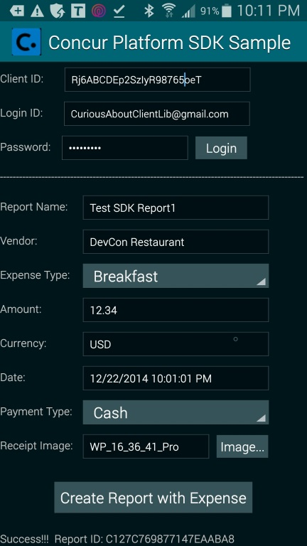

SDK Samples
============

We have samples in this SDK for different operating systems (Windows, Android, and iOS) but they all have similar functionality. The Windows sample though also displays expense policies and the obtained OAuth token because we had more screen area to show them. Notice that it is recommended that you download all samples to your computer even if you just want to play with one of them because all samples reference the **_shared** folder.

You need user credentials for a sandbox company at Concur in order to play with any sample. If you don't have that then [read here](../README.md#User-Credentials-and-Sandbox-Company) how to obtain it.

Please notice that the UI in any sample is split in 2 areas (top area and bottom area). 
* The top area displays what a typical app installation UI would display. It expects the user to input his/her login ID and password so that the app could obtain and store the OAuth token for that user (a typical app shouldn't store the user's login ID and password, it should only store the OAuth token). ConcurPlatform library can perform web service calls on the behalf of a user just using his/her OAuth access token. Notice that the Client ID displayed in the UI is an unique ID used by the [OAuth protocol](https://tools.ietf.org/html/rfc6749) in order to uniquely identify an app. An app should use the same OAuth Client ID no matter how many times it gets installed and no matter in which device it gets installed. Therefore a real app should hardcode (or download during installation) the OAuth Client ID and it shouldn't display this ID to users. In our sample we require the user to input the Client ID just because it isn't a production app and therefore the Client ID will be different in each sandbox company. ConcurPlatform library doesn't need the OAuth client ID in order to perform web service calls, it only needs the user's OAuth access token.
* The bottom area displays what a typical app would request as user input in order to submit to the user's company at Concur one expense report with one expense entry and an associated receipt image.  

All samples do the following:
1. Login to your company at Concur and 

###Windows Sample Screenshot

###Android Sample Screenshot

###iOS Sample Screenshot

